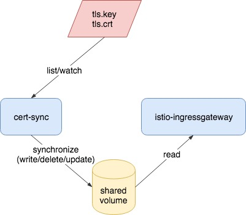

# cert-sync

cert-sync is a [Istio](https://istio.io/) add-on to automate the synchronization between
Kubernetes TLS secrets and istio-ingressgateway certificates, without having to re-deploy
the istio-ingressgateway pods.

For any user-specified Kubernetes TLS secret, it will ensure there's a pair of
corresponding public certificate (.crt) and private key (.key) exist in a shared volume
path, which will later be loaded by istio-ingressgateway. If users update/delete those
secrets, their corresponding keys and certs will be updated/deleted, too.



## Deployment

As already menthioned above, the idea of how cert-sync collaborates with
istio-ingressgateway is that they share a volume path (directory), where certificates and
private keys in TLS secrets will be placed into.

Generally, users may choose one of the following methods to deploy cert-sync.

### Sidecar

The sidecar way is straightforward. We simply add a cert-sync container into
istio-ingressgateway's pod spec, and mount a shared volume to both of them. For example,

```
...
  ...
    ...
      containers:
        - name: ingressgateway
          image: "gcr.io/istio/proxyv2:1.0.0"
          imagePullPolicy: IfNotPresent
          ports:
            - containerPort: 80
            - containerPort: 443
            - containerPort: 31400
          args:
          - proxy
          - router
          - -v
          - "2"
          - --discoveryRefreshDelay
          - '1s' #discoveryRefreshDelay
          - --drainDuration
          - '45s' #drainDuration
          - --parentShutdownDuration
          - '1m0s' #parentShutdownDuration
          - --connectTimeout
          - '10s' #connectTimeout
          - --serviceCluster
          - istio-ingressgateway
          - --zipkinAddress
          - zipkin:9411
          - --statsdUdpAddress
          - istio-statsd-prom-bridge:9125
          - --proxyAdminPort
          - "15000"
          - --controlPlaneAuthPolicy
          - NONE
          - --discoveryAddress
          - istio-pilot.istio-system:8080
          env:
          - name: POD_NAME
            valueFrom:
              fieldRef:
                apiVersion: v1
                fieldPath: metadata.name
          - name: POD_NAMESPACE
            valueFrom:
              fieldRef:
                apiVersion: v1
                fieldPath: metadata.namespace
          - name: INSTANCE_IP
            valueFrom:
              fieldRef:
                apiVersion: v1
                fieldPath: status.podIP
          - name: ISTIO_META_POD_NAME
            valueFrom:
              fieldRef:
                fieldPath: metadata.name
          volumeMounts:
          - name: certdir
            mountPath: "/etc/istio/ingressgateway-certs"
        - name: cert-sync
          image: "gcr.io/dunjut/cert-sync:latest" # not exist yet
          imagePullPolicy: IfNotPresent
          args:
          - --certDir
          - /etc/istio/ingressgateway-certs
          volumeMounts:
          - name: certdir
            mountPath: "/etc/istio/ingressgateway-certs"
      volumes:
      - name: certdir
        emptyDir: {}
      ...
```

Note a shared volume is a requirement, but its type doesn't have to be emptyDir. Users
may choose other volume types like hostPath and cephfs as long as these are preferred
under their Kubernetes environments.

To get cert-sync working correctly, users also have to add secrets accessibility to the
`istio-ingressgateway-istio-system` ClusterRole. Here is what will be look like:

```
apiVersion: rbac.authorization.k8s.io/v1beta1
kind: ClusterRole
metadata:
  labels:
    app: gateways
    chart: gateways-1.0.0
    heritage: Tiller
    release: istio
  name: istio-ingressgateway-istio-system
rules:
- apiGroups: ["extensions"]
  resources: ["thirdpartyresources", "virtualservices", "destinationrules", "gateways"]
  verbs: ["get", "watch", "list", "update"]
- apiGroups: [""]
  resources: ["secrets"]
  verbs: ["get", "watch", "list"]
```

Now the final step is to re-apply the modified istio-ingressgateway configurations.

### DaemonSet

Some users may run Kubernetes in bare-metal environments and do not have LoadBalancer
service supported. Under this circumstance, cluster operators may deploy istio-
ingressgateway in edge nodes using DaemonSet, with hostNetwork and a node selector.

To make sure each istio-ingressgateway instance has a cert-sync co-located in the same
machine, DaemonSet and same node selector should be used. The shared volume may be
hostPath or other types as long as it suits your environment. As cert-sync is deployed
separated from istio-ingressgateway, serviceaccount with appropriate permissions must be
created.

The example installation yaml file can be found [here](./install/cert-sync.yaml).

## How to use

### Upload TLS secrets

Users should store their TLS certificates and private keys in [Kubernetes Secrets](https://kubernetes.io/docs/concepts/configuration/secret/).
These secrets must be `kubernetes.io/tls` type and have the following annotation exists.

```
certsync.istio.io/autosync: "true"
```

This annotation tells cert-sync to watch its updates and synchronize it. Here is an
example:

```
apiVersion: v1
kind: Secret
metadata:
  annotations:
    certsync.istio.io/autosync: "true"
  name: example-com
  namespace: foo
type: kubernetes.io/tls
data:
  tls.crt: <Base64EncodedCertificateData>
  tls.key: <Base64EncodedPrivateKeyData>
```

### Use TLS secrets in Istio Gateway

cert-sync will place your TLS data files in this kind of file path:

```
<certdir>/<namespace>/<name>.key
<certdir>/<namespace>/<name>.crt
```

For example, we've specified `/etc/istio/ingressgateway-certs` as our certificate
direcotry, and we've also created a secret `example-com` in namespace `foo`. So the TLS
data files would be:

```
/etc/istio/ingressgateway-certs/foo/example-com.key
/etc/istio/ingressgateway-certs/foo/example-com.crt
```

Then use them in [Istio Gateway](https://istio.io/docs/reference/config/istio.networking.v1alpha3/#Gateway).

```
apiVersion: networking.istio.io/v1alpha3
kind: Gateway
metadata:
  name: example-com-gateway
  namespace: foo
spec:
  selector:
    istio: ingressgateway
  servers:
  - port:
      number: 443
      name: https
      protocol: HTTPS
    tls:
      mode: SIMPLE
      serverCertificate: /etc/istio/ingressgateway-certs/foo/example-com.key
      privateKey: /etc/istio/ingressgateway-certs/foo/example-com.crt
    hosts:
    - "example.com"
```
